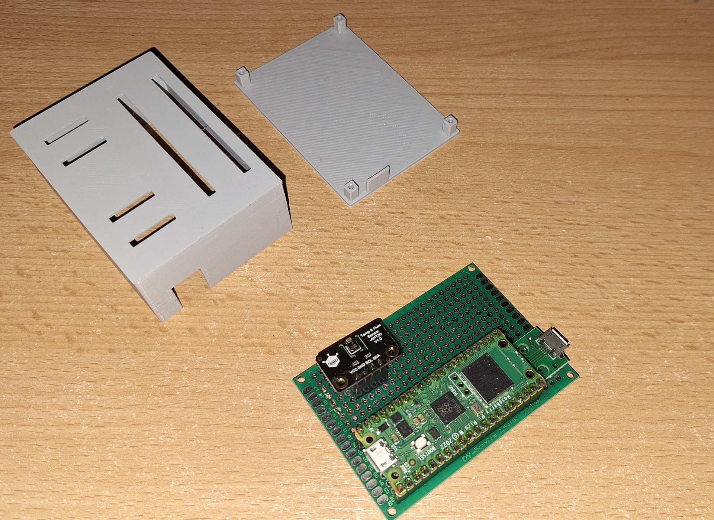
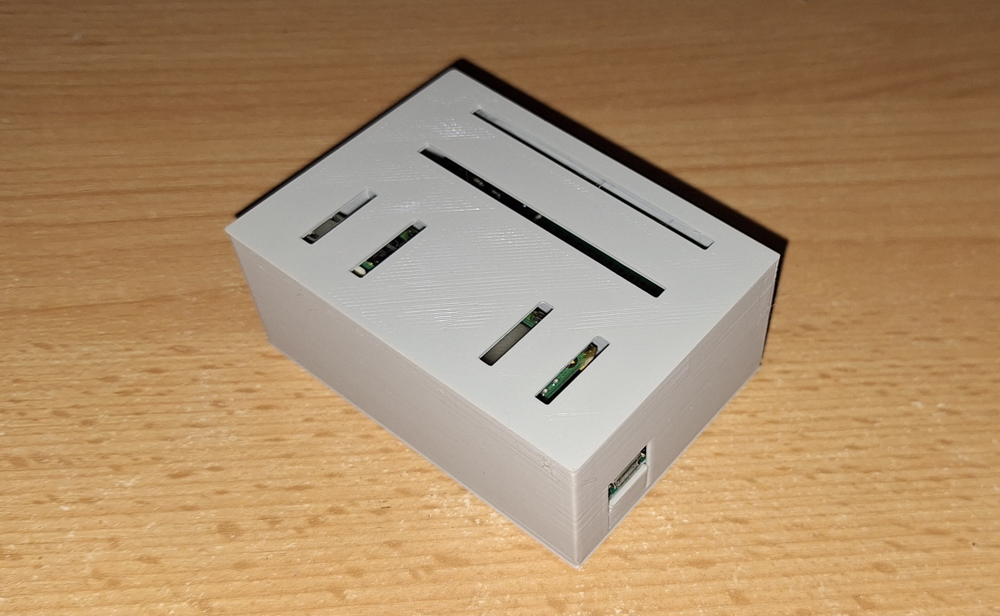

# CrowsNest
lightberryAPI + Raspberry Pi Pico W = LAN services hub




### Requirements (Microcontroller)

- [lightberryAPI v1.2.6](https://github.com/zNitche/lightberryAPI/releases/tag/v1.2.6) - frozen module
- [aht20.py](https://github.com/zNitche/pico-aht20/blob/master/aht20.py) - frozen module
- [microHTTP v1.0.0](https://github.com/zNitche/microHTTP/releases/tag/v1.0.0) - frozen module

### Features:
- Providing API + serving services data for [web ui](https://github.com/zNitche/CrowsNestUI).
- Logging environment temperature and humidity.
- Serving React based frontend.
- Build in database supporting data sorting and querying.
- Database models serialization.
- Simple cache implementation.
- Checking services accessibility.

### How to use it:
1. Build (and flash rpi pico with) MicroPython firmware with modules described in `Requirements` section.
2. Build and prepare (described in README) [web ui](https://github.com/zNitche/CrowsNestUI).
3. Copy content of web ui `dist` to `/files` directory.
4. Create and fill `lightberryAPI` config.
```
cp lightberry_config.template.json lightberry_config.json
```
5. Create and fill database.
```
cp db.template.json db.json
```
6. Flash Raspberry Pi Pico with this project files.

### Project Goals:
The main goals of the project was to: 
- Use lightberryAPI in real case scenario.
- Build low power consumption device I can use to track LAN services.
- Design and 3D print case for device.

### Extra
#### Database tools
- minify `db.json`
  ```
  python3 tools/convert_db.py --db_path ./db.json --minify
  ```
- de-minify `db.json`
  ```
  python3 tools/convert_db.py --db_path ./db.json
  ```

### Development
packages in `requirements.txt` are used for development

```
pip3 install -r requirements.txt
```

#### Remote Shell
for flashing pico you can use `rshell`
```
pip3 install rshell==0.0.32
```

enter REPL
```
rshell 
repl
```

flash
```
rshell -f commands/flash
```

clear all files
```
rshell -f commands/wipe
```
